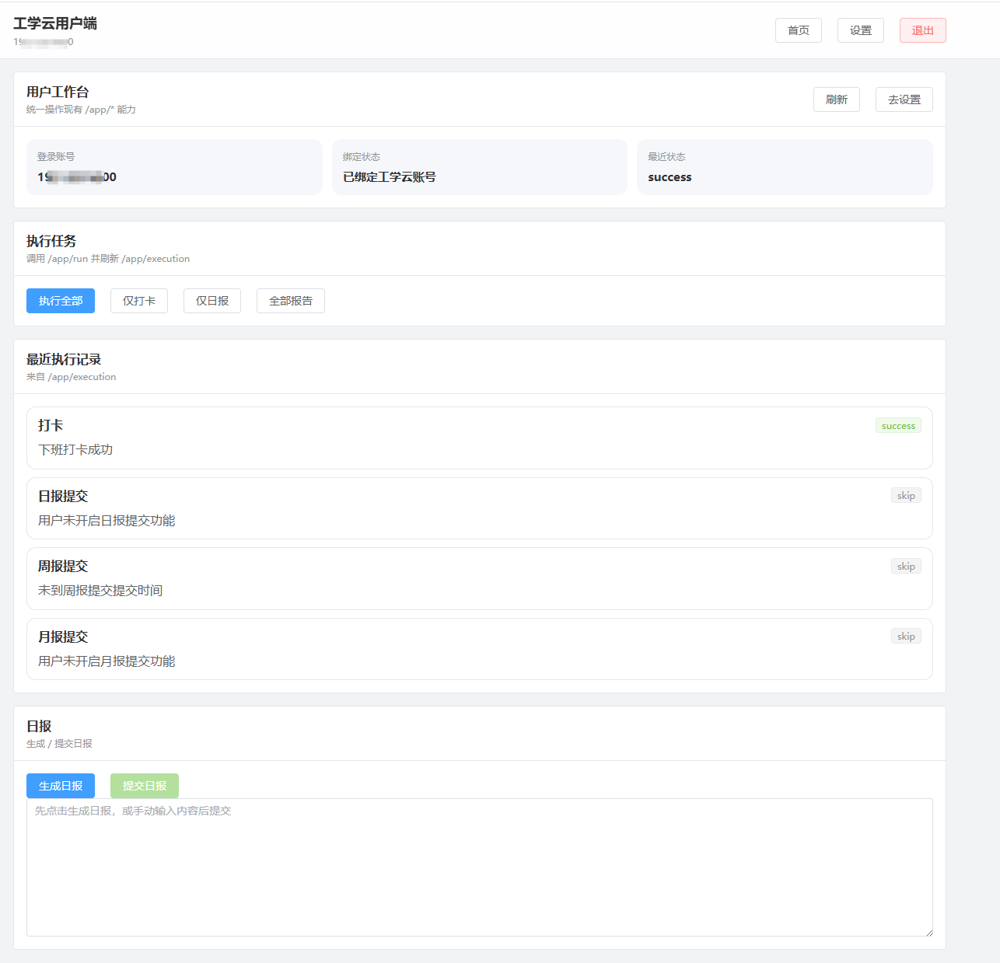
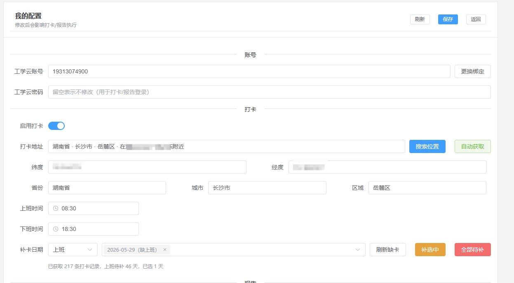
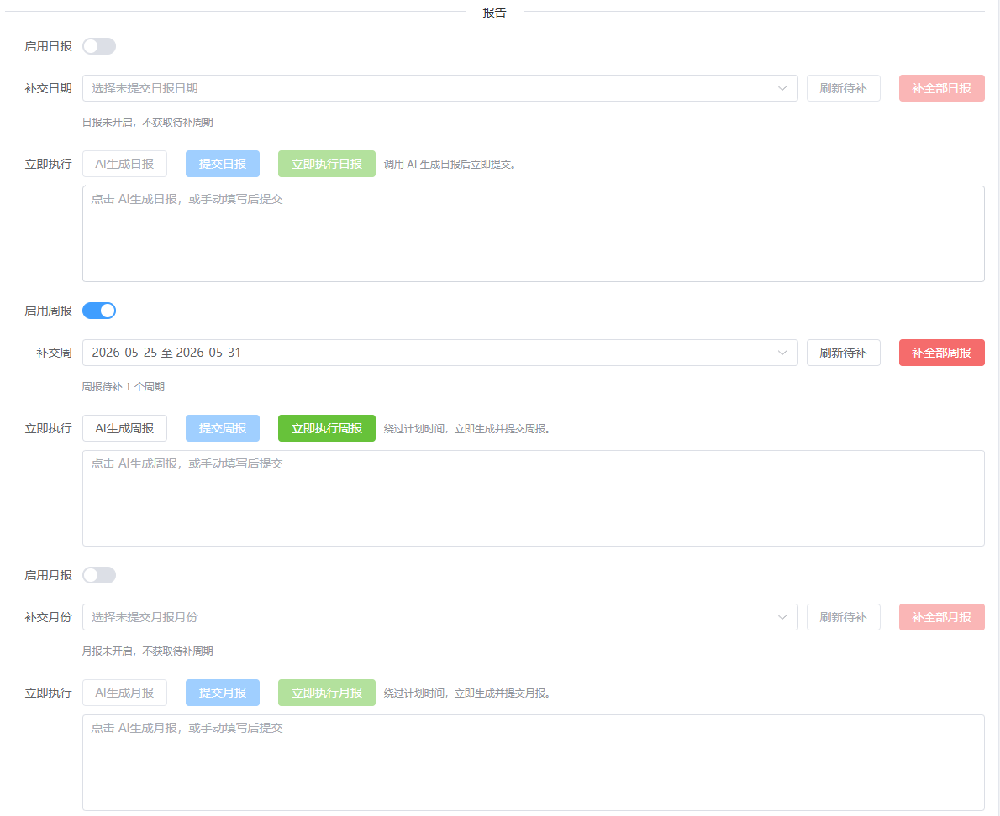
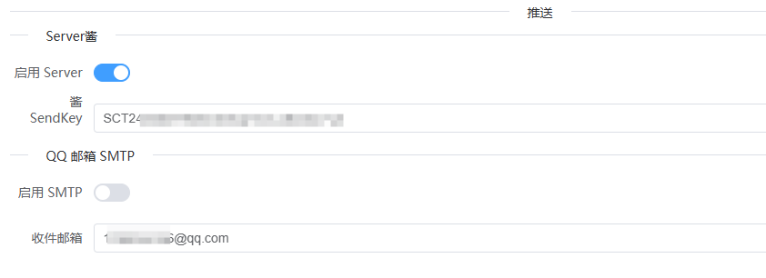

# AutoMoGuDing SaaS 前端

`web/` 是 AutoMoGuDing SaaS 的 Vue 3 前端工程，包含管理端和用户端两套页面。项目使用 Vite 构建，UI 组件基于 Element Plus。

## 前端速览

| 维度 | 内容 |
|------|------|
| 框架 | Vue 3 |
| 构建工具 | Vite |
| 状态管理 | Pinia |
| 路由 | Vue Router |
| UI | Element Plus |
| HTTP | Axios |
| 地图辅助 | 默认内嵌 `https://www.mapchaxun.cn/jingweidu` 作为经纬度核对页 |

## 页面结构

### 管理端

| 路径 | 页面 | 说明 |
|------|------|------|
| `/login` | 后台登录页 | 管理员入口 |
| `/` | 用户列表 / 管理首页 | 已登录管理员访问根地址进入后台 |
| `/create` | 新增用户页 | 创建用户与基础配置 |
| `/edit/:id` | 用户编辑页 | 打卡、补卡、报告、单用户推送 |
| `/audit` | 审计日志页 | 关键操作记录 |
| `/settings` | 系统设置页 | AI、SMTP、工学云补卡代理 |
| `/settings/notifications` | 通知设置页 | 全局邮箱通知 |

### 用户端

| 路径 | 页面 | 说明 |
|------|------|------|
| `/u/login` | 用户登录页 | 独立用户端认证状态 |
| `/u/register` | 用户注册页 | 受后端注册开关控制 |
| `/u` | 用户工作台 | 手动执行、执行记录、日报快捷入口 |
| `/u/settings` | 我的配置 | 打卡、报告、补卡、个人推送 |

用户端和管理端登录态不混用。管理端使用 `src/stores/auth.js`，用户端使用 `src/stores/userAuth.js`。

## 截图速览

### 管理端

| 用户列表 | 打卡设置 |
|---|---|
|  |  |

| 补卡详情 | 日报 / 周报 / 月报补交 |
|---|---|
|  |  |

| 报告设置 | 推送设置 | 全局邮箱通知 |
|---|---|---|
|  |  |  |

### 用户端

| 用户工作台 | 打卡配置 |
|---|---|
|  |  |

| 报告配置 | 推送配置 |
|---|---|
|  |  |

## 页面说明

### 用户工作台

`/u` 对应 `UserHome.vue`。页面聚焦于日常操作：展示登录账号、绑定状态和最近状态，提供统一执行入口，以及日报的生成与提交快捷区。

### 我的配置

`/u/settings` 对应 `UserSettings.vue`。页面集中放置账号绑定、工学云打卡配置、日报 / 周报 / 月报配置和个人推送设置。

### 管理端用户编辑页

`/edit/:id` 对应 `UserEdit.vue`。管理端可在同一页完成用户的打卡、补卡、报告和推送配置，和用户端页面保持同一套字段口径。

## 开发命令

| 命令 | 说明 |
|------|------|
| `cd web` | 进入前端目录 |
| `npm install` | 安装依赖 |
| `npm run dev` | 启动 Vite，默认监听 `0.0.0.0:5173` |
| `npm run preview` | 预览构建产物 |

### 环境变量

| 环境变量 | 作用 |
|----------|------|
| `VITE_API_PROXY_TARGET` | 覆盖 `/api` 代理目标，默认 `http://127.0.0.1:8147` |
| `VITE_MAP_DISPLAY_URL` | 覆盖管理端打卡设置中内嵌的经纬度核对页 |

示例：

```bash
VITE_API_PROXY_TARGET=http://127.0.0.1:8147 npm run dev
```

## 接口约定

| 主题 | 约定 |
|------|------|
| API 前缀 | 前端统一通过 `/api` 访问后端 |
| 管理端请求 | `src/api/http.js` |
| 用户端请求 | `src/api/userHttp.js` |
| 错误提示 | `src/utils/notify.js` 统一解析并展示 |
| 认证失败 | `401` 清空对应端登录态并跳转对应登录页 |
| Cookie | 后端使用 HttpOnly Cookie；前端不把 token 放进 `localStorage` |
| CSRF | 非安全方法由后端校验 CSRF，前端按 Axios 实例约定携带 |

## 目录结构

| 路径 | 说明 |
|------|------|
| `web/src/api/` | 管理端和用户端 Axios 实例 |
| `web/src/router/` | 路由、认证守卫和入口分流 |
| `web/src/stores/` | 管理端和用户端认证状态 |
| `web/src/utils/` | 消息提示等前端工具 |
| `web/src/views/` | 页面组件 |
| `web/vite.config.js` | Vite 配置和 `/api` 代理 |
| `web/package.json` | 前端依赖和脚本 |

## 联调提示

| 场景 | 说明 |
|------|------|
| 本地开发后端不在默认地址 | 用 `VITE_API_PROXY_TARGET` 指向后端地址 |
| 打卡设置页内嵌地图显示异常 | 检查 `VITE_MAP_DISPLAY_URL` 是否可访问 |
| 用户端登录后被带回登录页 | 检查用户端 cookie、后端会话和 `401` 处理 |
| 管理端和用户端互相串号 | 检查是否同时打开了两套登录态，或浏览器残留旧 cookie |
